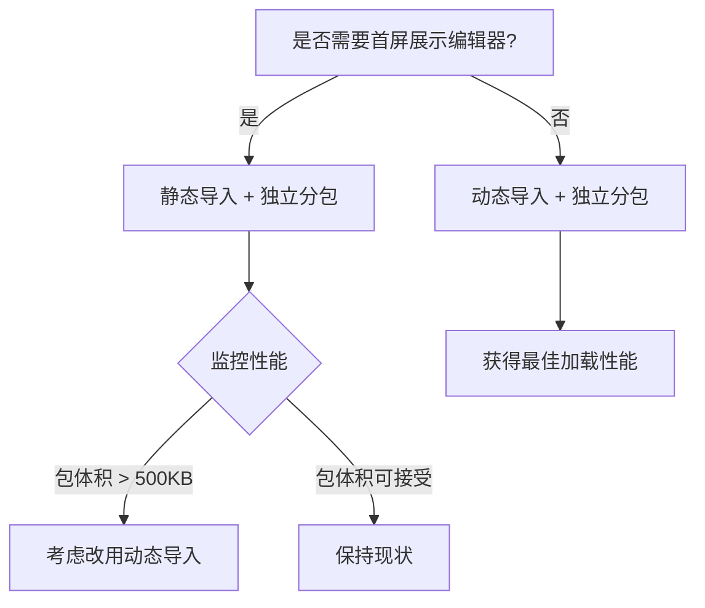

# 1. loader
- ant design pro项目里，使用webpackChain无效，可能内部有配置覆盖

- ### 如何在代码里使用特定loader
  - 在配置里用rule+test+use的方式配置
  - 在import或require语句中使用loader前缀
    - `!` 前缀会禁用所有已配置的 normal loader。
    - `!!` 前缀会禁用所有已配置的 loader（包括 pre 和 post）。
    - `-!` 前缀会禁用所有已配置的 pre 和 normal loader。
    
  import md from '!!raw-loader!./markdown.md'

  所以 `!!raw-loader!` 的作用是：跳过所有其他配置的 loader，只使用 raw-loader 来处理文件。

  这种方式通常用于特定情况下覆盖默认配置，不是所有 loader 都需要这样使用。

- ### 常用的 loader
  1. `babel-loader`: 转换 ES6+ 代码为 ES5。
  2. `css-loader`: 解析 CSS 文件，处理 CSS 中的依赖。
  3. `style-loader`: 将 CSS 插入到 DOM 中。
  4. `sass-loader`: 将 SASS/SCSS 转换为 CSS。
  5. `file-loader`: 处理文件导入，返回文件的 URL。
  6. `url-loader`: 类似 file-loader，但可以返回 data URL。
  7. `ts-loader`: 将 TypeScript 转换为 JavaScript。
  8. `eslint-loader`: 在 Webpack 编译过程中运行 ESLint。
  9. `vue-loader`: 处理 Vue 单文件组件。
  10. `html-loader`: 导出 HTML 为字符串，需要时最小化 HTML。


# 2. 配置项

```js
const path = require('path');
const webpack = require('webpack');
const MiniCssExtractPlugin = require('mini-css-extract-plugin');
// const UglifyJsPlugin = require('uglifyjs-webpack-plugin');
const TerserJSPlugin = require('terser-webpack-plugin');
const OptimizeCSSAssetsPlugin = require('optimize-css-assets-webpack-plugin');
// const SpeedMeasurePlugin = require('speed-measure-webpack-plugin')
// const { CleanWebpackPlugin } = require('clean-webpack-plugin');
// const LoadablePlugin = require('@loadable/webpack-plugin')

// const smp = new SpeedMeasurePlugin() // 测量构建速度
const devMode = process.env.NODE_ENV !== 'production';
const pkg = require('./package.json');

module.exports = ({
  mode: devMode ? 'development' : 'production',
  devtool: devMode ? 'inline-source-map' : 'hidden-source-map',
  entry: path.resolve(__dirname, './src/index.ts'),
  output: {
    path: path.resolve(__dirname, './dist'),
    filename: devMode ? 'linyreact.js' : 'linyreact.min.js',
    library: 'linyreact',
    libraryTarget: 'umd'
  },
  resolve: {
    // Add `.ts` and `.tsx` as a resolvable extension.
    extensions: ['.ts', '.tsx', '.js'],
    alias: {
    }
  },

  module: {
    rules: [
      // all files with a `.ts` or `.tsx` extension will be handled by `ts-loader`
      {
        test: /\.tsx?$/,
        use: [
          'babel-loader?cacheDirectory',
          {
            loader: 'ts-loader',
            options: {
              configFile: 'tsconfig.json'
            }
          }
        ]
      },
      {
        test: /\.(sa|sc|c)ss$/,
        use: [
          {
            loader: MiniCssExtractPlugin.loader // 抽取样式文件，将css样式文件用link标签引入，使用此loader就不需要用style-loader，即使用了也不会有效果
          },
          {
            loader: 'css-loader',
            options: {
              modules: {
                auto: true,
                localIdentName: devMode ? '[path][name]__[local]' : '[hash:base64:5]'
              },
              importLoaders: 2, // 一个css中引入了另一个css，也会执行之前两个loader，即postcss-loader和sass-loader
            }
          },
          {
            // 使用 postcss 为 css 加上浏览器前缀
            loader: 'postcss-loader',
            options: {
              // options has an unknown property 'plugins';
              postcssOptions: {
                // PostCSS plugin autoprefixer requires PostCSS 8.将autoprefixer降到8.0.0版本
                plugins: [require('autoprefixer')]
              }
            }
          },
          {
            loader: 'sass-loader' // 使用 sass-loader 将 scss 转为 css
          }
        ]
      },
      {
        test: /(\.(eot|ttf|woff|woff2)|font)$/,
        loader: 'file-loader',
        options: { outputPath: 'fonts/' }
      },
      {
        test: /\.(png|jpg|gif|svg|jpeg)$/,
        loader: 'file-loader',
        options: { outputPath: 'images/' }
      }
    ]
  },
  plugins: [
    // new CleanWebpackPlugin(),
    // new LoadablePlugin(),
    // 该插件能够使得指定目录被忽略，从而使得打包变快，文件变小;下面忽略了包含’./locale/'该字段路径的文件目录,但是也使得我们使用的时候不能显示中文语言了，所以这个时候可以手动引入中文语言的目录
    // new webpack.IgnorePlugin(/\.\/locale/, /moment/),
    // 主要用于对打包好的js文件的最开始处添加版权声明
    new webpack.BannerPlugin(`linyreact ${pkg.version}`),
    // 将CSS提取到单独的文件中
    new MiniCssExtractPlugin({
      // Options similar to the same options in webpackOptions.output
      // both options are optional
      filename: devMode ? 'linyreact.css' : 'linyreact.min.css',
      chunkFilename: '[id].css'
    })
    // devMode ? new webpack.HotModuleReplacementPlugin() : null
  ],
  optimization: {
    minimizer: devMode
      ? []
      : [
          // 压缩js代码
          // new UglifyJsPlugin({
          //   cache: true, // 启用文件缓存并设置缓存目录的路径
          //   parallel: true, // 使用多进程并行运行
          //   sourceMap: true // set to true if you want JS source maps
          // }),
          // webpack v5 使用内置的TerserJSPlugin替代UglifyJsPlugin，因为UglifyJsPlugin不支持ES6
          new TerserJSPlugin({
            // cache: true, // 启用文件缓存并设置缓存目录的路径
            parallel: true, // 使用多进程并行运行
            // sourceMap: true // set to true if you want JS source maps
          }),
          // 用于优化或者压缩CSS资源
          new OptimizeCSSAssetsPlugin({
            assetNameRegExp: /\.css$/g,
            cssProcessor: require('cssnano'), // 用于优化\最小化 CSS 的 CSS 处理器，默认为 cssnano
            cssProcessorOptions: { safe: true, discardComments: { removeAll: true } }, // 传递给 cssProcesso
            canPrint: true // 布尔值，指示插件是否可以将消息打印到控制台，默认为 true
          })
        ],
    sideEffects: false,
    // "sideEffects": ["./src/some-side-effectful-file.js"],防止被tree shaking
  }
});

```

# 3. node 功能注入

  前端打包工具（如Webpack、Vite等）会在构建过程中，识别并替换所有`process.env.NODE_ENV`为部署时确定的环境变量。这是通过`DefinePlugin`插件来实现的。

  ### 配置Webpack中的DefinePlugin

  在Webpack配置文件中，可以使用`DefinePlugin`插件注入环境变量。以下是一些基本配置的示例：

  ```javascript
  const webpack = require('webpack');
  module.exports = {
    plugins: [
      new webpack.DefinePlugin({
        'process.env.NODE_ENV': JSON.stringify(process.env.NODE_ENV)
      })
    ]
  };
  ```

  ### package.json

  通过`package.json`中的脚本设置不同的环境：

  ```json
  {
    "scripts": {
      "start": "NODE_ENV=development webpack serve",
      "build": "NODE_ENV=production webpack"
    }
  }
  ```

  ### 在ant design pro项目里自定义
  通常使用umi的功能，即 .env 文件配置，然后在代码里使用 process.env.xxx 来获取环境变量
  
  步骤：
  1. 创建.env文件，内容为： TEST_ENV=SHADOW, 或者在config/config.ts里，直接使用process.env.TEST_ENV = 'SHADOW'
  2. config/config.ts里加入：export default defineConfig({define: {'process.env': process.env,},});
  3. 在代码里使用：process.env.TEST_ENV
  
  注意，如果要使用自定义的变量，第二步是必须的，默认情况下，process.env.NODE_ENV是webpack处理的，代码里(node启动 和 项目运行)都能用，但是如果不写第二步，
  那么process.env.TEST_ENV只能在node启动时使用，运行时就没有了。有了第二步后，process.env.TEST_ENV就能在运行时使用了。

# 4. webpack-chain 其他依赖于webpack的项目，如下：
查看craco.config.js, antdp1/config/config.js,

# 5. 分析工具 antdp的 npm run analyze 如何找到具体文件
 
### 1. 增强 webpack-bundle-analyzer 配置

修改 `package.json` 中的 analyze 脚本：

```json
"scripts": {
  "analyze": "cross-env NODE_OPTIONS=--max_old_space_size=8192 ANALYZE=1 SOURCE_MAP=1 umi build"
}
```

### 2. 为 UmiJS 配置添加更详细的 Bundle 分析选项

在 `.umirc.js` 或 `config/config.js` 中添加以下配置：

```javascript
export default {
  analyze: .... //见antdp1代码
  
  chainWebpack: (config,{webpack}) => {
    if (process.env.ANALYZE) {
      .....//见antdp1代码
    }
  },
  
  // 启用代码分割
  chunks: ['vendors', 'umi'],
}
```
### 3. 创建一个分析脚本来解读 stats.json

创建 `cripts/analyze-vendors.js`： ....//见antdp1代码

创建 `scripts/optimize-vendors.js`： ....//见antdp1代码

### 3. 运行分析脚本

```bash
npm run analyze
# 先运行分析脚本
node scripts/analyze-vendors.js

# 然后生成优化建议
node scripts/optimize-vendors.js
```
--------------------------------

# 6.解决 Lodash 优化后大小未变的问题
问题：即使将 `import _ from "lodash"` 改成 `import { debounce } from 'lodash'` 的按需导入形式，但最终打包的大小并没有减少。

### 关键问题分析
即使使用 `import { debounce } from 'lodash'`，Webpack 仍会导入整个 lodash，这是因为：

1. lodash 主要使用 CommonJS 模块格式，不易进行 tree-shaking,  使用 lodash-es 替代 lodash

lodash-es 是 Lodash 的 ES 模块版本，更容易进行 tree-shaking：

2. 直接从特定路径导入 import { debounce } from 'lodash-es';

3. 增强 Webpack 配置以确保 tree-shaking 生效

修改 UmiJS 配置文件（`.umirc.js` 或 `config/config.js`）：

```javascript
// 这一段没有用到，但是一个办法
export default {
  // 其他配置...
  
  // 启用 tree-shaking
  treeShaking: true,
  
  // 增强 Webpack 配置
  chainWebpack: (config) => {
    // 已有配置...
    
    // 确保 Lodash 被正确处理
    config.resolve.alias
      .set('lodash', 'lodash-es');
    
    // 启用 terser 更积极的优化
    config.optimization.minimizer('terser').tap(args => {
      args[0] = {
        ...args[0],
        terserOptions: {
          ...args[0].terserOptions,
          compress: {
            ...args[0].terserOptions.compress,
            // 启用更激进的优化
            pure_getters: true,
            unsafe: true,
            unsafe_comps: true,
            warnings: false,
          }
        }
      };
      return args;
    });
  },
  
  // 设置 node_modules 的处理方式
  nodeModulesTransform: {
    type: 'none',  // 对某些模块禁用转换以保留 ES 模块特性
    exclude: ['lodash-es']  // 不排除 lodash-es，让它正常转换
  },
}
```

我已经将所有的lodash全部替换成了lodash-es,并且已经将package.json里的lodash换成了lodash-es，并且删除了node_modules，重新npm install,但是在node_module里的还是能看到lodash，和lodash-es并存，所以说，是有别的第三方库在用lodash
解决：  配置 Webpack 别名将第三方库的 `lodash` 引用重定向到 `lodash-es`

### 1. 查找依赖 lodash 的第三方库

创建脚本 `scripts/find-lodash-deps.js`: //见antdp1代码

### 2. 使用 npm-why 工具追踪依赖

安装和使用 npm-why 工具：

```bash
# 安装 npm-why
npm install -g npm-why

# 查找谁依赖了 lodash
npm-why lodash
```

### 3. 配置 Webpack 别名重定向 lodash 到 lodash-es

修改 UmiJS 配置文件（`.umirc.js` 或 `config/config.js`）：

```javascript
export default {
  // 其他配置...
  
  // 添加别名，将 lodash 引用重定向到 lodash-es
  alias: {
    'lodash': 'lodash-es',
  },
  
  // 增强 webpack 配置，处理 lodash 相关问题
  chainWebpack: (config) => {
    // 确保所有 lodash 引用使用 lodash-es
    config.resolve.alias
      .set('lodash', 'lodash-es');
    
    // 处理 lodash-es 的 tree-shaking
    config.optimization.usedExports(true);
    
  }
}
```

# 7, 这个analyze命令能不能将每个页面的build时间输出出来？
### 1. 创建页面构建时间跟踪插件

创建 `scripts/webpack-page-build-time-plugin.js` 文件: //见antdp1代码

### 2. 创建一个更完整的入口点统计插件

为了更准确地跟踪 UmiJS 的页面构建时间，创建一个专门针对 entry 的插件:scripts/webpack-entry-build-time-plugin.js //见antdp1代码

### 3. 修改 UmiJS 配置文件，集成这些插件 //见antdp1代码`config/config.js`:

### 4. 扩展 analyze 命令，添加构建时间统计功能

创建一个包装脚本 `scripts/analyze-with-times.js`: //见antdp1代码

### 5. 更新 package.json 添加新的分析命令 // analyze:times //见antdp1代码,实测不用这个命令也能看到时间

# 8. ant design pro + umi + webpac的缓存
有2个缓存目录：src/.umi/.cache 和 node_modules/.cache
默认情况下，umi里用的是teser,不需要额外配置。*其他框架* 如果要配置，加入以下代码
```js
// config/config.ts， webpack 4.x
    config.cache(true);
    config.optimization
      .minimizer('terser')
      .tap((args) => {
        const [terserOptions] = args;
        return [
          {
            ...terserOptions,
            cache: true,
            parallel: true,
            terserOptions: {
              ...terserOptions.terserOptions,
              compress: {
                ...terserOptions.terserOptions?.compress,
                drop_console: process.env.NODE_ENV === 'production',
              },
            },
          },
        ];
      });
  // webpack 5.x
  config.cache({
    type: 'filesystem',
    cacheDirectory: path.resolve(__dirname, '.cache/webpack'),
    buildDependencies: {
      config: [__filename],
    },
  });
  config.optimization.minimize(true);
``` 
```Katex 
$$
\begin{array}{|c|c|c|}
\hline
\textbf{目录} & \textbf{node\_modules/.cache} & \textbf{.umi/.cache} \\
\hline
\text{创建者} & \text{Webpack/Babel 等底层工具} & \text{Umi 框架自身} \\
\hline
\text{缓存类型} & \text{构建工具链缓存} & \text{框架运行时缓存} \\
\hline
\text{主要内容} & \text{Webpack 5 持久化缓存、Babel 转译缓存} & \text{路由配置缓存、插件状态缓存} \\
\hline
\text{体积占比} & 70\%+ & 30\%- \\
\hline
\text{清除影响} & \text{导致完整重构建} & \text{触发路由重新分析} \\
\hline
\end{array}
$$
```
npm run build的时候，这两个目录都会参与，在两个缓存都有的情况下，epl构建时间为115s，
实测：如果仅删除node_modules/.cache，时间会增加到330s，如果仅删除.umi/.cache，时间会增加到130s.

### 典型目录结构
```shell
node_modules/
└── .cache/
    ├── webpack/         # Webpack 5 持久化缓存
    ├── babel-loader/    # Babel 转译结果缓存 
    └── terser-webpack-plugin/ # 代码压缩缓存

.umi/
└── .cache/
    ├── route.json       # 路由配置快照  
    ├── pluginapi.json   # 插件 API 状态
    └── mfsu/           # MFSU 编译缓存（若启用）
```

# 9. ant design pro + umi 3.x 的默认分包策略：
```js
// config/config.ts
 chainWebpack(config) {
    // 修改 splitChunks 配置
    config.optimization.splitChunks({
      cacheGroups: {
        vendor: {
          test: /[\/]node_modules[\/]/, // 匹配 node_modules 中的模块
          name: 'vendors', // 将它们打包成名为 vendors 的文件
          chunks: 'all' // 对所有类型的 chunk 都应用这个规则
          priority: 10, // 优先级
        },

        // 这个是将整个node_modules里用到的代码都打到一个vendor.xxx.js
        // 这里主要影响的是浏览器缓存策略，并不是打包的时候用到的缓存。
        commons: {
          name: 'commons',
          // 提取至少被两个 chunk 引用的模块
          minChunks: 2,
          priority: 5,
          chunks: 'all',
        },
        // 可以添加更多分组...
      },
    });
  }

如果我启用了cacheGroups：vendors:{....}
第一版里，我的A.tsx组件里用了import{ Button} from "antd",
第二版本里，我的A.tsx里变成了import{ Button,Space} from "antd",且【没有其他组件】用antd库，那么，第二次打包的时候，vendors.xxx.js一定会变大。
第三版里，添加了B.tsx,里面引用了import { Button, Space } from "antd"，那这个vendors.hash.js的内容在webpack4里面，有可能变化（可能编译依赖顺序变化导致），但是在5里面，不会变化。

反映到dockerfile里, 如果使用了二级dockerfile，那要定期的更新基础镜像。即使package.json不修改，缓存也需要更新。见antdp1的dockerfile
```


--------------------------------

Question: 
在默认的情况下，node_modules会怎么分包，我现在还没有修改任何配置
Answer: 
### 一、默认分包规则
1. **Vendor 主包**  
   所有 `node_modules` 中的依赖默认会被打包到 `vendors.[hash].js` 文件中，这是通过以下隐式配置实现的：
   ```javascript
   splitChunks: {
     chunks: 'all',                // 同步/异步代码都分包
     minSize: 30000,               // 超过 30KB 的依赖才会独立分包
     cacheGroups: {
       vendors: {
         test: /[\\/]node_modules[\\/]/,  // 匹配 node_modules
         name: 'vendors',           // 输出文件名
         priority: -10,            // 优先级
         reuseExistingChunk: true  // 重复使用已有 chunk
       }
     }
   }
   ```

2. **异步加载分包**  
   使用动态导入（如 `import('module')`）的第三方库会生成独立异步 chunk：
   ```javascript
   // 会生成类似 543.async.js 的独立文件
   import('lodash').then(...);
   ```

3. **子依赖合并**  
   如果多个模块共用同一 npm 包（如 `react` 被多个组件引用），它们会被合并到同一个 chunk 中。

---

### 二、典型输出结构
打包后的 `dist` 目录会呈现以下分包效果：
```
dist/
├─ umi.js                # 业务代码主包
├─ vendors.1a2b3c.js      # node_modules 主包（含未异步加载的依赖）
├─ 543.async.js          # 异步加载的第三方库（如动态导入的 lodash）
├─ 233.async.js          # 其他异步 chunk
└─ ...                   
```

---

### 四、验证默认行为的场景
假设你的项目有以下依赖：
```javascript
// 页面 A
import { Button } from 'antd';

// 页面 B（动态导入）
() => import('antd').then(...);
```
则打包结果为：
- `antd` 会出现在 `vendors.js`（同步主包）
- 动态导入的 `antd` 会生成独立异步 chunk（如 `233.async.js`）

---

### 五、自定义配置建议
如果需要修改默认分包策略（如分离特定大型库），可在 `config.ts` 中覆盖配置：
```typescript
// config/config.ts
chainWebpack: (memo) => {
  memo.optimization.splitChunks({
    cacheGroups: {
      // 覆盖默认 vendors 配置
      vendors: {
        test: /[\\/]node_modules[\\/]/,
        name: 'custom-vendor',
        chunks: 'all',
        minSize: 50000,  // 最小体积阈值提高到 50KB， 避免小型库被单独分包
        priority: 20
      },
      // 单独拆分 monaco-editor
      monaco: {
        test: /[\\/]node_modules[\\/]monaco-editor[\\/]/,
        name: 'monaco',
        chunks: 'all',
        enforce: true
      },
              // antd 单独打包
      antd: {
        name: 'antd',
        test: /[\\/]node_modules[\\/](@ant-design|antd)[\\/]/,
        priority: 20,
        minSize: 50000, // 50KB
      },
      // echarts 单独打包
      echarts: {
        name: 'echarts',
        test: /[\\/]node_modules[\\/](echarts|zrender)[\\/]/,
        priority: 20,
        minSize: 50000, // 50KB
      },
    }
  });
  return memo;
}
```

通过这种配置，`monaco-editor` 会被单独打包成 `monaco.[hash].js`，避免与主 vendors 包混杂。
--------------------------------

Question: 
问题1：如果我是这样导入的monaco， import 'react-monaco-editor' 那么默认情况想，他会被打包到整个项目的那一个大的vendor.xxx.js里吗？
问题2：
如果我有的文件是这样导入的monaco：const MonacoEditor = React.lazy(() => import('react-monaco-editor'));，
有的文件是直接 import 'react-monaco-editor' 。
那么这个monaco包会怎么分 ？是单独的包，还是与其他包合并到一个vendors里？
这个react-monaco-editor又会依赖monaco-editor，那这俩包会放到一个vendors里吗？
问题3：你前面说的“超过 30KB 的依赖会自动独立分包 (minSize 阈值)”，这个配置如果我要修改的话，在chainwebpack里怎么修改？
Answer: 
以下是针对您三个问题的技术解析：

---

### **问题1：直接导入的 `import react-monaco-editor` 分包位置**
**结果**：  
默认情况下会被打包到 `vendors.[hash].js` 主包中。

**原因**：  
- 直接导入属于同步加载
- 默认 `splitChunks.cacheGroups.vendors` 会捕获所有 `node_modules` 中的同步依赖
- 除非该包体积超过 30KB **且** 被多个异步 chunk 共享，否则不会单独分包

---

### **问题2：混合导入时的分包逻辑**
#### 场景描述
```javascript
// 文件A：同步导入
import 'react-monaco-editor'; 

// 文件B：动态导入
const MonacoEditor = React.lazy(() => import('react-monaco-editor'));
```

#### 分包结果分析
| 文件/依赖                | 分包位置                          | 条件判断                                                                 |
|--------------------------|-----------------------------------|--------------------------------------------------------------------------|
| `react-monaco-editor`    | `vendors.js` **和** 异步 chunk    | 同步部分进主包，动态导入部分生成异步 chunk (如 `543.async.js`)             |
| `monaco-editor` (子依赖) | 统一进 `vendors.js`               | 子依赖默认跟随父级包，除非显式配置独立分包                                 |

#### 关键机制
1. **同步与异步的混合处理**  
   - 同步导入部分会保留在 `vendors.js`
   - 动态导入部分会生成独立异步 chunk
   - **最终产物会同时存在两份代码**（主包和异步包），需要通过 `optimization.runtimeChunk` 去重

2. **子依赖合并规则**  
   - `monaco-editor` 作为 `react-monaco-editor` 的依赖，默认会跟随父级包位置
   - 如果项目中还有其他地方直接使用 `monaco-editor`，则可能触发二次分包


#### 阈值调整效果
| 配置项          | 修改前 | 修改后 | 影响范围                           |
|-----------------|--------|--------|------------------------------------|
| `minSize`       | 30KB   | 50KB   | 只有超过 50KB 的依赖才会独立分包    |
| `vendors.minSize` | -      | 50KB   | 仅针对 vendors 组的二次条件过滤     |

---

### **终极优化建议**
针对 `monaco-editor` 这类大型库，推荐强制独立分包：
```typescript
chainWebpack: (memo) => {
  memo.optimization.splitChunks({
    cacheGroups: {
      monaco: {
        test: /[\\/]node_modules[\\/](monaco-editor|react-monaco-editor)[\\/]/,
        name: 'monaco',
        chunks: 'all',
        enforce: true, // 强制绕过 minSize/minChunks 等限制
        priority: 20   // 高于默认 vendors 的优先级
      }
    }
  });
}
```
此配置会将所有相关依赖打包到 `monaco.[hash].js` 中，彻底解决重复加载问题。
--------------------------------

Question: 
      monaco: {
        test: /[\\/]node_modules[\\/]monaco-editor[\\/]/,
        name: 'monaco',
        chunks: 'all',
        enforce: true
      }
如果我这样单独给他分包了，那么我在代码里是不是就不需要React.lazy这样加载了？
Answer: 
这是典型的「物理分包」与「逻辑加载」的配合问题，我们分两个层面来解析：

---

### 一、配置效果解析
**产生的效果**：  
1. 所有 `monaco-editor` 及其子依赖会被强制打包到独立文件 `monaco.[hash].js`
2. **无论代码体积大小**（`enforce:true` 会跳过 `minSize` 等阈值校验）
3. **无论是否动态导入**（`chunks: 'all'` 包含同步/异步代码）

---

### 二、代码加载方式选择
是否动态加载与分包策略并不直接相关，可以用lazy,也可以不用，用lazy，那么作用就是不会卡住渲染，不用lazy，那么就会白屏一段时间，等待monaco加载完毕。
--------------------------------

Question: 
        chunks: 'all',不懂这句的含义是啥？chunks有哪些取值？各表示什么含义？每一种取值结合例子说明区别
Answer: 

在 webpack 的 `splitChunks` 配置中，`chunks` 参数决定了哪些类型的代码块会被优化分包。以下是各取值的详解和场景对比：

---

### 一、参数定义
`chunks` 参数控制分包策略的作用范围，有三种主要取值：

| 取值      | 中文含义           | 作用范围                          |
|-----------|--------------------|----------------------------------|
| `'async'` | 异步代码块 (默认值) | 只处理动态导入（`import()`）的模块 |
| `'initial'` | 初始代码块         | 只处理同步导入的模块              |
| `'all'`   | 所有代码块         | 同时处理同步和异步模块            |

---

### 二、不同取值的场景模拟
我们通过一个具体案例来演示差异：

#### 项目结构
```javascript
// 页面A.js (同步加载)
import React from 'react';          // 50KB
import lodash from 'lodash';        // 500KB

// 页面B.js (动态加载)
const getLodash = async () => {
  const _ = await import('lodash'); // 动态导入 500KB
  return _.sum([1,2]);
}
```

---

#### 场景 1：`chunks: 'async'` (默认值)
```javascript
splitChunks: {
  chunks: 'async',
  cacheGroups: {
    vendors: {
      test: /[\\/]node_modules[\\/]/,
      name: 'vendors'
    }
  }
}
```

**打包结果**：
```
dist/
├─ vendors.7a8b9c.js    # 空文件（因为动态导入的 lodash 已被单独处理）
├─ 233.async.js         # 包含 lodash（500KB）
└─ 页面A.js              # 包含 react + lodash（550KB）
```

**现象分析**：  
- 动态导入的 `lodash` 被单独分包（符合 `async` 策略）
- 同步导入的 `lodash` 仍保留在页面A中（未触发分包）

---

#### 场景 2：`chunks: 'initial'`
```javascript
splitChunks: {
  chunks: 'initial',
  cacheGroups: {
    vendors: {
      test: /[\\/]node_modules[\\/]/,
      name: 'vendors'
    }
  }
}
```

**打包结果**：
```
dist/
├─ vendors.7a8b9c.js    # 包含 react + 同步的 lodash（550KB）
├─ 233.async.js         # 包含动态导入的 lodash（500KB）
└─ 页面A.js              # 无 node_modules 内容
```

**现象分析**：  
- 同步导入的 `react` 和 `lodash` 被打包到 `vendors.js`
- 动态导入的 `lodash` 重复出现在异步 chunk 中（未复用同步包）

---

#### 场景 3：`chunks: 'all'`
```javascript
splitChunks: {
  chunks: 'all',
  cacheGroups: {
    vendors: {
      test: /[\\/]node_modules[\\/]/,
      name: 'vendors'
    }
  }
}
```

**打包结果**：
```
dist/
├─ vendors.7a8b9c.js    # 包含 react + lodash（550KB）
├─ 页面A.js              # 无 node_modules 内容
└─ 页面B.js              # 无 node_modules 内容
```

**现象分析**：  
- 所有 `node_modules` 依赖被提取到公共包
- 动态导入的 `lodash` 直接复用 `vendors.js` 中的代码
- **完全消除重复代码**

---

### 三、核心差异对比表
| 对比维度          | `async`             | `initial`           | `all`               |
|-------------------|---------------------|---------------------|---------------------|
| 同步模块处理      | 不处理              | 提取到公共包         | 提取到公共包         |
| 动态模块处理      | 单独分包            | 单独分包            | 尝试复用公共包       |
| 代码重复可能性    | 高（同步模块重复）  | 高（动态模块重复）  | 低                  |
| 适用场景          | SPA 异步功能模块    | 传统多页同步应用     | 现代复杂应用         |

---

### 四、最佳实践建议
1. **优先使用 `all`**  
   现代项目普遍推荐此模式，可最大化代码复用，特别是当你的项目中同时存在：
   - 同步加载的核心库（如 `react`）
   - 动态加载的辅助库（如 `lodash`）

2. **例外情况使用 `initial`**  
   需要确保动态加载的库版本独立时（如 A/B 测试不同版本库）

3. **慎用 `async`**  
   只适用于简单的异步功能模块，多数场景下会导致重复代码

通过合理配置 `chunks` 参数，可显著优化应用的加载性能和代码复用率。
--------------------------------

Question: 
你刚才提到all的情况为：vendors.7a8b9c.js    # 包含 react + lodash（550KB）
那如果再加一个monaco-editor,那么这个会极大增加vendors.js的体积，这样是不合理的。因为我可能只有一个页面会用monaco,但是打到这个唯一的vendors里就会导致其他页面无论用不用monaco，都会把含有monaco的vendors下载下来。我不想让monaco-editor放到这个vendors里，要怎么做？
Answer: 

针对大型库单独分包的优化需求，可以通过 **精细化配置 `cacheGroups`** 实现。以下是具体解决方案：

---

### 一、问题核心分析
当使用 `chunks: 'all'` 时，默认的 `vendors` 分组会贪婪捕获所有 `node_modules` 依赖。要避免 `monaco-editor` 污染主 vendors 包，需要：

1. **隔离策略**：通过独立 `cacheGroups` 强制分离特定库
2. **优先级控制**：确保新分组的优先级高于默认 `vendors`
3. **按需加载**：结合动态导入实现精准加载

---

### 二、配置方案
```typescript
// config/config.ts
chainWebpack: (memo) => {
  memo.optimization.splitChunks({
    chunks: 'all',
    cacheGroups: {
      // 1. 单独处理 monaco-editor
      monaco: {
        test: /[\\/]node_modules[\\/](monaco-editor|react-monaco-editor)[\\/]/,
        name: 'monaco',
        chunks: 'all',
        priority: 20,     // 高于默认 vendors 的优先级
        enforce: true,    // 强制拆分，无视 minSize 等限制
        reuseExistingChunk: true
      },
      // 2. 默认 vendors 配置（排除已单独分包的库）
      vendors: {
        test: /[\\/]node_modules[\\/](?!(monaco-editor|react-monaco-editor))/,
        name: 'vendors',
        priority: -10,
        chunks: 'all',
        reuseExistingChunk: true
      }
    }
  });
}
```

--------------------------------

Question: 
 dist/vendors~p__Applications__ConfigUpd      29.1 KB        9.6 KB
 ate.56d9c955.async.js
 dist/199.c225406f.async.js                   27.7 KB        7.1 KB
 dist/vendors~p__Applications__Npcpd__Fs      18.8 KB        6.9 KB
 tConfig~p__Applications__Npcpd__NpcpdRe
 portLv2~p__Applications__fi~d11f5ec4.bb
 4457df.async.js
 dist/p__Applications__ConfigUpdate.bd8c      17.1 KB        4.6 KB
 76bb.async.js
 dist/p__Applications__finance__Approval      16.7 KB        5.7 KB
 List.16b972ec.async.js
 dist/170.75077125.async.js                   16.6 KB        4.8 KB
 dist/vendors~p__Applications__finance__      11.6 KB        4.0 KB
 ApprovalList~p__CMA__UNP__TaskList~p__U
 ser__Group__My~p__User__Res~4d78f7c3.0c
 dd4c7a.async.js
 dist/178.111eb541.async.js                   11.5 KB        4.2 KB
 dist/p__CMA__UNP__TaskList.55ffbf35.async
这是我的项目npm run build的部分输出，我很奇怪为什么会有这么多vendors呢，比如dist/vendors~p__Applications__ConfigUpdate.56d9c955.async.js      29.1 KB        9.6 KB
 
似乎是每个页面都有一个vendors，如果有css的话，页面还会多一个css的vendors
但是似乎又不是，像 dist/p__Applications__APA__ApaParams.1c43ebe7.async.js      9.6 KB         2.9 KB
这个就没有vendors,
问题：1，为啥我的ant design pro + umi3.x的项目，默认情况下的build根你描述的不一样？似乎没有一个全局的大vendors，而是好像是跟页面绑定的，而且有的页面有vendors，有的没有，规则是啥？2，为啥不是默认的将所有的node_modules打包成一个vendors.js?,3,是不是只要用了单独的css文件，就会生成额外的vendors.xxx.css?4，他这种配置在chainWebpack里怎么实现？

Answer: 

### 深度解析 Umi 3.x 分包机制及解决方案

---

#### **问题本质**  
您看到的分包现象是 Umi 3.x **默认开启路由级代码分割 (route-based code splitting)** 的结果，这种设计比传统单 vendors 包更精细化。以下是关键机制解析：

---

### 一、分包规则详解

| 文件模式                        | 生成条件                                                                 | 示例文件                                                                 |
|---------------------------------|--------------------------------------------------------------------------|--------------------------------------------------------------------------|
| `vendors~页面路径.async.js`     | 当多个异步 chunk 共享某些 node_modules 依赖时自动生成共享包              | `vendors~p__Applications__ConfigUpdate.56d9c955.async.js`               |
| `页面路径.async.js`             | 当页面独享某些依赖时直接合并到页面 chunk                                | `p__Applications__APA__ApaParams.1c43ebe7.async.js`                     |
| `vendors.js`                    | **默认不会生成**，除非显式配置全局 vendors                               | 无                                                                      |

---

### 二、现象原因解析

#### 1. **为何没有全局 vendors.js？**  
Umi 3.x 默认启用了更激进的代码分割策略：
```javascript
// Umi 默认隐藏配置
splitChunks: {
  chunks: 'async',
  minSize: 30000,
  cacheGroups: {
    vendors: {
      name: 'vendors',  // 实际上被覆盖为路由级 vendors
      test: /[\\/]node_modules[\\/]/,
      chunks: 'async',  // 关键配置：仅处理异步 chunk
      priority: -10
    }
  }
}
```
**关键点**：`chunks: 'async'` 导致同步加载的 node_modules 不会被统一分包，而 **每个异步 chunk 会生成自己的 vendors 子包**。

#### 2. **为何有的页面有 vendors 子包？**  
当页面满足以下条件时生成：
- 使用了动态导入（如路由懒加载）
- 依赖的 node_modules 体积超过 30KB
- 该依赖被至少两个异步 chunk 共享




$$ F(\omega) = \int_{-\infty}^{\infty} f(t) e^{-i\omega t} dt $$
傅里叶变换将时域信号$f(t)$转换为频域表示$F(\omega)$，其中$\omega$为角频率，$i$是虚数单位。逆变换公式为：  
$$ f(t) = \frac{1}{2\pi} \int_{-\infty}^{\infty} F(\omega) e^{i\omega t} d\omega $$